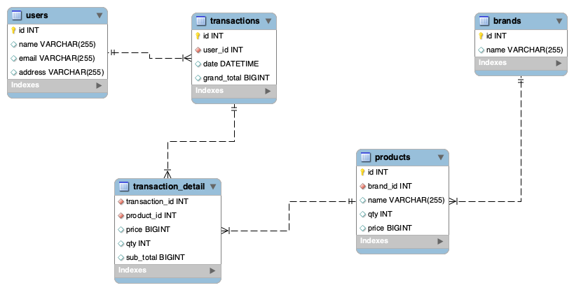

# Jamtangan.com Backend Test

***Constraint and Requirement***
- One brand can have many/multiple products
- One product will have exactly one brand
- Every product have a “price” field/property
- Customer will be able to make a transaction/order
- Customer can see the transaction detail
- You can be as creative as you can for those database table fields.
- You can use CLI migration tool for your SQL schema, Eg:
https://github.com/golang-migrate/migrate
https://github.com/pressly/goose
- Do not use third party library for Multiplexer or router, only use “net/http” standard library, hint: https://golang.org/pkg/net/http/#NewServeMux
- Do not use ORM, you can use any sql driver
- You can use any third party library for testing (unit test or integration test)
- You can use third party library to validate input from client side/user input
- It is up to you to decide which parameters are required and which parameter is optional
for each endpoint.
- No authentication required
- Please put your assumptions and how to in a README.md

***Task***
1. Create Database Schema using RDBMS based on Constraint and Requirements above
2. Create Web API service (JSON API) with Go/Golang based on Constraint and
Requirements above with these functionalities:

# Solution

## Database Schema


## Building and Running The App

Prerequisites:

1. Go 1.16
2. Docker
3. Docker Compose
4. Golang migrate (https://github.com/golang-migrate/migrate)

The App is separate into three services, User service, Product service, Transaction service but in one App

**Step 1 Checkout**

```bash
$ git clone https://github.com/arieffian/mw-backend-test.git
$ cd mw-backend-test
```

**Step 2 Start MySQL Service**

```bash
$ docker-compose up
```

**Step 2 Run Migration**

```bash
$ migrate -database mysql://mw-backend:mw-backend@/mw-backend -path ./sql up
```

**Step 3 Calling APIs**

Create Brand
```bash
$ curl -X POST -H 'content-type: application/json' --data '{"name": "acer"}' http://localhost:8080/brand
``` 

Get Product by ID
```bash
$ curl http://localhost:8080/product?id=1
``` 

Create Product
```bash
$ curl -X POST -H 'content-type: application/json' --data '{"brand_id": 4, "name": "predator", "qty": 3, "price": 1050}' http://localhost:8080/product
``` 

Get Product by Brand ID
```bash
$ curl http://localhost:8080/product/brand?id=1
``` 

Create Transaction
```bash
$ curl -X POST -H 'content-type: application/json' --data '{"user_id": 1,"detail": [{"product_id": 1,"qty": 1},{"product_id": 2,"qty": 1},{"product_id": 3,"qty": 1}]}' http://localhost:8080/order
``` 

Get Transaction by ID
```bash
$ curl http://localhost:8080/order?id=1
``` 

## Testing App

```bash
$ go test ./... -cover -vet -all -v
``` 